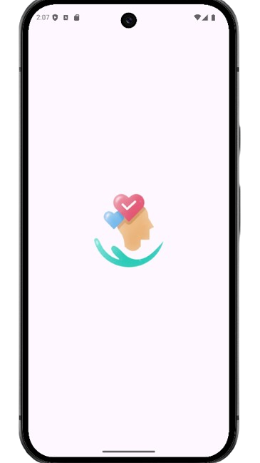
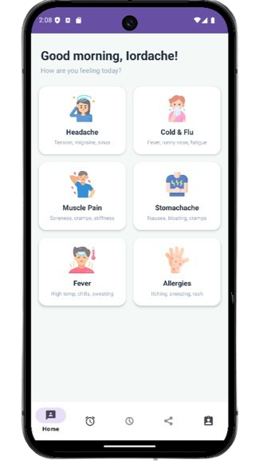
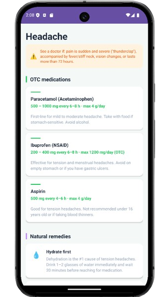
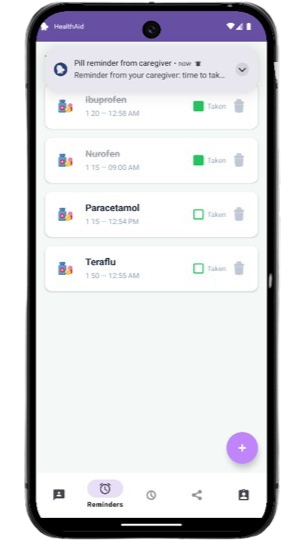
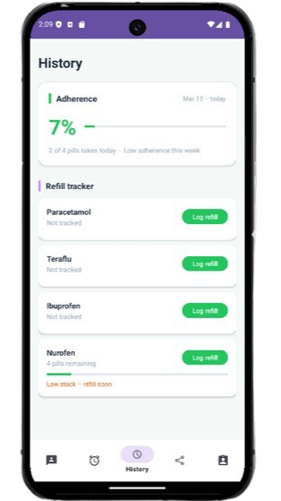
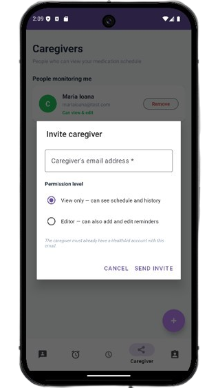
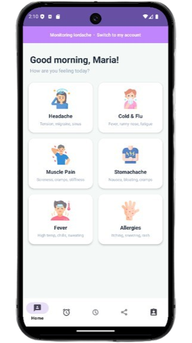
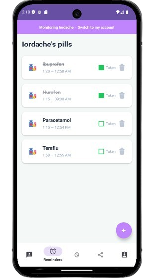
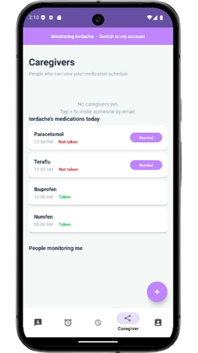

# HealthAid


A comprehensive Android health companion app designed to help users manage daily medication reminders, track symptoms, monitor pill stock levels, and share health oversight with trusted caregivers. Built with a focus on real-world Firebase integration, clean fragment-based architecture, and a polished Material 3 UI.

---

## Screenshots

### User account

| App open                      | Home                           | Symptom detail                    |
|-------------------------------|--------------------------------|-----------------------------------|
|  |  |  |

| Pill reminders                    | History                           | Invite caregiver                      |
|-----------------------------------|-----------------------------------|---------------------------------------|
|  |  |  |

### Caregiver point of view

| Home (caregiver)                    | Patient pill list                      | Monitoring tab                         |
|-------------------------------------|----------------------------------------|----------------------------------------|
|  |  |  |

---

## Key Features

### Symptom Guide
- Responsive 2-column grid of 6 common ailments: Headache, Cold & Flu, Muscle Pain, Stomachache, Fever, Allergies
- Each symptom opens a detailed screen with:
    - 3 OTC medications with exact dosages and clinical notes
    - 4 natural remedies with the science behind each one
    - Colour-coded warning banner for when to seek a doctor
    - Medical disclaimer

### Daily Pill Reminders
- Add medications with pill name, dosage, unit, and a native **TimePicker** dialog
- Real-time Firestore sync — pills appear instantly without page refresh
- **Daily reset logic** — pills automatically uncheck each morning using a `takenDate` field, no server-side job needed
- Marking a pill taken **decrements the pill count** in a Firestore transaction
- Delete with confirmation — cancels the AlarmManager alarm atomically

### Notification System
- **Daily alarms** via `AlarmManager.setAlarmClock()` — fires even in Doze mode
- `USE_EXACT_ALARM` permission — pre-granted, no user action required
- `BootReceiver` reschedules all alarms after device restart
- Notification tapping opens the Reminders tab directly

### Adherence History
- Weekly adherence score (%) with a progress bar
- "X of Y pills taken today" summary
- Colour-coded label: Good / Moderate / Low

### Refill Tracker
- Per-medication pill count with a visual stock progress bar
- Low stock warning when pills drop to or below the threshold (default: 7)
- Log refill dialog captures pills added, pharmacy name, prescription reference, and notes
- Firestore transaction atomically updates pill count and writes a `refill_records` subcollection entry

### Caregiver System
- **Invite caregivers by email** — looks up the caregiver's account in Firestore
- Two permission levels: **View only** and **Editor**
- **Manual mode toggle banner** — a purple banner at the top of the app lets a caregiver switch between their own account and monitoring a patient
- In caregiver mode:
    - Reminders tab shows the **patient's** pill list with taken/not-taken status
    - History tab shows the **patient's** adherence and refill data
    - View-only caregivers cannot add, edit, or delete medications
    - Editor caregivers have full access
- **Missed dose nudge** — caregivers can tap "Remind" on any untaken pill to send a push notification to the patient via a Firestore `notifications` subcollection
- Revoke caregiver access at any time (soft delete — access history is preserved)

### User Profile
- Stores name, age, weight, and known allergies in Firestore
- Initials avatar auto-generated from the user's name
- Profile loads on open, saves with `SetOptions.merge()` to avoid overwriting other fields

---

## Architecture

### Activities
| Class | Role |
|---|---|
| `SplashActivity` | Auth state check, personalised greeting from Firestore, fade to MainActivity |
| `LoginActivity` | Firebase sign-in with field-level validation and loading state |
| `RegisterActivity` | Registration with full email/password validation and strength meter |
| `MainActivity` | Single-activity host — manages bottom nav, caregiver banner, SessionManager init |
| `SymptomDetailActivity` | Detailed symptom view with medication cards and remedy cards |

### Fragments
| Class | Role |
|---|---|
| `HomeFragment` | Symptom grid with time-of-day greeting personalised from Firestore |
| `ReminderFragment` | Pill list with add/taken/delete, caregiver-aware |
| `HistoryFragment` | Adherence score + refill tracker, caregiver-aware |
| `CaregiverFragment` | Manage own caregivers + patient pill monitoring with nudge system |
| `ProfileFragment` | User profile read/write from Firestore, logout |

### Adapters
| Class | Role |
|---|---|
| `SymptomAdapter` | Grid adapter for symptom cards with subtitle |
| `ReminderAdapter` | List adapter for pill reminders with daily-reset checkbox logic |

### Data Models
| Class | Firestore Path |
|---|---|
| `PillReminder` | `users/{uid}/medications/{medId}` |
| `DoseLog` | `users/{uid}/medications/{medId}/dose_logs/{logId}` |
| `RefillRecord` | `users/{uid}/medications/{medId}/refill_records/{refillId}` |
| `CaregiverLink` | `caregiver_links/{linkId}` |

### Utilities
| Class | Role |
|---|---|
| `SessionManager` | Singleton tracking own vs caregiver mode, active user ID, permissions |
| `ReminderScheduler` | Wraps AlarmManager — schedule/cancel exact daily alarms |
| `ReminderReceiver` | BroadcastReceiver — fires notification at alarm time, reschedules for next day |
| `BootReceiver` | Reschedules all alarms after device reboot |
| `MissedDoseWatcher` | Watches patient's notifications subcollection and fires local nudge notifications |

---

## Tech Stack

| Layer | Technology |
|---|---|
| Language | Java |
| Min SDK | API 26 (Android 8.0) |
| Target SDK | API 34 (Android 14) |
| UI | Material 3 components, CardView, RecyclerView, BottomNavigationView |
| Authentication | Firebase Authentication (Email/Password) |
| Database | Cloud Firestore (real-time listeners + transactions) |
| Notifications | AlarmManager (`USE_EXACT_ALARM`), NotificationCompat |
| Architecture | Single Activity, Fragment-based navigation, Singleton session state |

---

## Firestore Data Structure

```
users/
  {userId}/
    name, email, age, weight, allergies
    medications/
      {medId}/
        pillName, dosage, unit, time
        taken, takenDate
        isActive, pillsRemaining, lowStockThreshold
        createdAt
        dose_logs/
          {logId}/ — action, scheduledTime, actionAt
        refill_records/
          {refillId}/ — pillsAdded, pillsTotalAfter, pharmacyName, refillDate
    notifications/
      {notifId}/ — pillName, message, delivered, sentAt

caregiver_links/
  {linkId}/
    patientUserId, caregiverUserId
    caregiverEmail, caregiverName, patientName
    permissionLevel (view_only | editor)
    isActive, linkedAt
```

---

## Setup

### Prerequisites
- Android Studio Hedgehog or newer
- A Firebase project with **Authentication** and **Firestore** enabled
- `google-services.json` placed in the `app/` directory

### Steps
1. Clone the repository
   ```bash
   git clone https://github.com/yourusername/HealthAid.git
   ```
2. Open in Android Studio
3. Add your `google-services.json` to `app/`
4. In Firebase Console → Firestore → Rules, paste the security rules from `firestore.rules` in the repo root
5. Build and run on a device or emulator running API 26+

---

## Planned Improvements
- [ ] Edit existing pill reminder (name, dosage, time)
- [ ] Full dose history log with timestamps (replace approximation)
- [ ] Support monitoring multiple patients as a caregiver
---

## Concepts Demonstrated

- **Fragment lifecycle management** with real-time Firestore `ListenerRegistration` (attach in `onStart`, detach in `onStop`)
- **Firestore transactions** for atomic multi-field updates (taken toggle + pill count decrement, refill logging)
- **AlarmManager** exact alarms with `BootReceiver` for post-reboot rescheduling
- **Singleton session state** (`SessionManager`) for cross-fragment context without passing arguments
- **`@PropertyName` annotation** to fix Java boolean getter serialization with Firestore
- **Daily reset without a server** using a `takenDate` string compared to today's date on read
- **Soft deletes** throughout — `isActive: false` instead of document deletion, preserving history
- **Material 3** `TextInputLayout` with inline field errors, password toggle, and helper text
- **RecyclerView** with multiple adapter patterns, `DiffUtil`-ready list management

---

## License

This project is intended for educational purposes. 